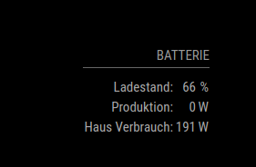

# MMM-Sonnen
A module for the MagicMirror project which creates a table filled with a list gathered from the Sonnenbattery 10

## Installation
```
git clone https://github.com/tkoeberl/MMM-Sonnen.git
```

## Config Options
| **Option** | **Default** | **Description** |
| --- | --- | --- |
| url | "" | The full url to get the json response from |
| header | "Battery" | The header of the shown table 
| updateInterval | 10000 | Milliseconds between the refersh |
| values | [["USOC","User state of charge:","%"],["Production_W","PV Production in watts:","W"],["Consumption_W","House comsumption:","W"]] | Array with [[keyOJson],[keyToShow],[unitToShow]]

## Result


## Configuration
```
{
        module: 'MMM-Sonnen',
        position: 'bottom_right',
        header: 'Batterie',
        config: {
                updateInterval: '20000',
                url: 'http://XXX.XXX.XXX.XXX:8080/api/v1/status', // Required
                "values": [["USOC","Ladestand:","%"],["Production_W","Produktion:","W"],["Consumption_W","Haus Verbrauch:","W"]] 
        }
}
```


